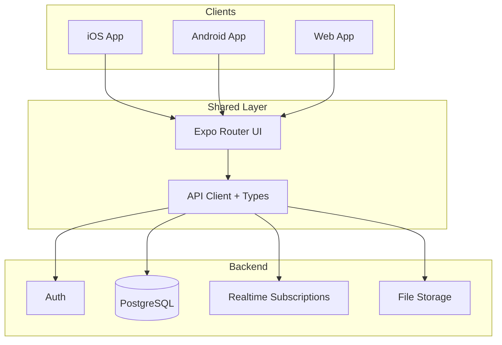
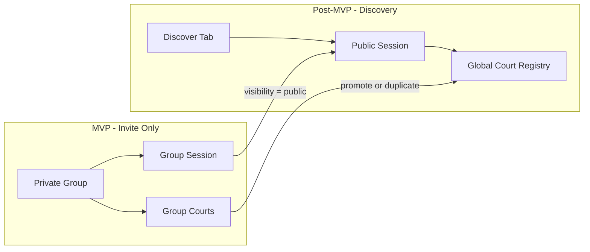

# Pickleball Coordination App — MVP Plan

## Problem You're Solving

GroupMe works for *announcing* pickleball sessions but breaks down when:
- RSVPs pile up in scrollback with no structured headcount or court count
- Skill levels are unknown until people show up — mismatched games frustrate everyone
- Court/venue details (indoor vs outdoor, number of courts, reservation info) get buried or repeated every week
- New players can't catch up on recurring spots or group norms

Your MVP replaces that chaos with **structured data** (profiles, courts, sessions) plus **just enough chat** to coordinate details—not a full GroupMe clone.

**Pickleball-only scope simplifies the MVP:** no multi-sport abstractions, pickleball-native terminology (courts, sessions, open play), and location fields that actually matter to your users.

---

## MVP Scope (In vs Out)

| In scope | Out of scope (future) |
|----------|----------------------|
| Auth + player profiles with pickleball skill | DUPR rating sync, peer skill ratings |
| Court/venue CRUD + map pin | Public session discovery / marketplace |
| Groups (private invite-link communities) | GroupMe import/sync |
| Sessions with RSVP + attendee list w/ skills | Recurring sessions, calendar sync |
| Session comments + group announcements | Full real-time group chat |
| Push/email notifications for session changes | Court reservation / payment integrations |
| Session type: open play vs fixed group size | Court rotation / round-robin scheduling |

---

## Recommended Architecture

For **web + mobile from day one** with minimal duplication, use a **single Expo (React Native) codebase** with Expo Router—it ships to iOS, Android, and web from one UI layer.



**Backend choice for fastest MVP:** [Supabase](https://supabase.com) (Postgres + Auth + Realtime + Row Level Security). If you prefer full control, swap Supabase for **NestJS + PostgreSQL + Prisma**—same data model, more setup time.

**Maps:** Mapbox or Google Maps SDK for court pins and "get directions."

**Notifications:** Expo Push Notifications for mobile; email via Resend/Supabase for web-only users.

---

## Core Data Model

Pickleball-only means **skill lives on the user profile** (not a separate sports table) and **locations are courts/venues** with pickleball-relevant metadata.

```mermaid
erDiagram
  User ||--o{ GroupMember : belongs_to
  User ||--o{ EventRsvp : responds
  Group ||--o{ GroupMember : contains
  Group ||--o{ Event : hosts
  Court ||--o{ Event : used_at
  Event ||--o{ EventRsvp : has
  Event ||--o{ EventComment : has
  Group ||--o{ GroupAnnouncement : has

  User {
    uuid id PK
    string display_name
    string avatar_url
    enum skill_level
    enum profile_visibility
    string phone_optional
  }

  Court {
    uuid id PK
    uuid group_id FK_nullable
    string name
    string address
    float lat
    float lng
    enum court_type
    int num_courts
    text notes
    uuid created_by FK
  }

  Group {
    uuid id PK
    string name
    string invite_code
    uuid created_by FK
  }

  Event {
    uuid id PK
    uuid group_id FK_nullable
    uuid court_id FK
    enum visibility
    datetime starts_at
    int max_players
    enum session_type
    enum skill_min
    enum skill_max
    text description
    uuid created_by FK
  }

  EventRsvp {
    uuid event_id FK
    uuid user_id FK
    enum status
  }
```

### Pickleball-specific fields

**User.skill_level:** `beginner | intermediate | advanced` (self-reported). Label as "self-reported" in UI. Future: optional DUPR rating field.

**Court.court_type:** `indoor | outdoor | both`

**Court.num_courts:** integer — how many pickleball courts at this venue (critical for capacity planning)

**Court.notes:** free text — "courts 3–6 in back", "need code for gate", "lights off at 9pm", "bring own balls"

**Event.session_type:**
- `open_play` — drop-in style; max_players is a soft cap or omitted
- `fixed_group` — known group size (e.g. 8 players, 2 courts)

**Event.max_players:** optional; when set, enables waitlist. For pickleball, organizers often think in multiples of 4 (one foursome per court).

**RSVP statuses:** `going | maybe | not_going | waitlist`

**Event.visibility (future-proofing):** `group_private | public` — MVP uses only `group_private`; UI ignores `public` until v2 discovery ships.

**Court.group_id:** required in MVP UI (all courts belong to a group); nullable in schema so global/shared courts can be added post-MVP without migration pain.

**User.profile_visibility (future-proofing):** `group_only | public` — default `group_only`; controls whether profile appears on public session attendee lists to non-group members in v2.

---

## Future-Proofing for Discovery (v2: "Find a Game Near Me")

MVP ships **invite-only groups**, but the schema and architecture should make adding public session discovery a **2–3 week additive feature** (~70–80% of MVP code reusable), not a 4–6 week rewrite.

### Why start private, design for public

| MVP (invite-only) | v2 (discovery) — additive layer |
|-------------------|-----------------------------------|
| Private groups + invite links | Same groups unchanged |
| Group-scoped courts | + Global court registry (or nullable `group_id`) |
| Sessions visible to group members only | + `visibility = public` sessions in Discover tab |
| Skill on RSVP lists within group | + Skill filters on nearby public sessions |

### Schema choices to bake in at MVP (minimal cost: ~0.5–1 day in Phase 1)

1. **`Event.visibility`** — enum `group_private | public`; default `group_private`; MVP never exposes `public` in UI
2. **Nullable `Event.group_id`** — MVP always sets it; v2 public sessions may omit group or use optional host group
3. **Nullable `Court.group_id`** — MVP always sets it; v2 adds global courts (`group_id = null`) for public sessions
4. **Indexed lat/lng on courts** — enable PostGIS extension in Supabase (or lat/lng composite index) from day one for distance queries later
5. **`User.profile_visibility`** — enum `group_only | public`; default `group_only`; no UI in MVP
6. **Denormalized coords on events (optional)** — copy court lat/lng to event at creation time so discovery queries don't require joins; cheap insurance for geospatial search

### What transfers directly to v2

- Player profiles + skill level → public session attendee lists, skill filters
- Sessions + RSVPs → same core loop; public sessions are just visible to more people
- Court lat/lng + map → "games near me" map view
- Session comments → public session coordination
- Push notifications → "new open play near you" alerts

### What v2 adds (estimated ~2–3 weeks post-MVP)

| Work item | Effort |
|-----------|--------|
| Discover tab (map + list, distance/skill/time filters) | ~1 week |
| Geospatial "near me" queries + device location permissions | ~3–5 days |
| Global court registry + deduping/moderation basics | ~1 week |
| Public session creation flow + RLS policy updates | ~3–5 days |
| Trust layer (report/block, rate limits, optional host approval) | ~1–2 weeks |

### Migration path



MVP users keep using private groups unchanged. Discovery is an **additive** layer: new tab, new visibility option, optional global courts — not a replacement for the group workflow.

### RLS design note

Write RLS policies in Phase 1 with discovery in mind:

- **MVP policy:** users can read events where they are a group member OR event creator
- **v2 extension:** add OR clause — `visibility = 'public'` AND `starts_at > now()` for discoverable upcoming sessions

Avoid hardcoding "every query joins through group_members" in application code; centralize access in RLS and typed API helpers so v2 is a policy extension, not an app-wide refactor.

---

## MVP User Flows

### 1. Onboarding
- Sign up via email, Google, or Apple (Apple required for iOS App Store if you offer other social login)
- Set display name + avatar
- Set **pickleball skill level** (beginner / intermediate / advanced)
- Optional: join a group via invite link/code immediately

### 2. Courts & Venues
- Any group member can add a court/venue: name, address (autocomplete), indoor/outdoor, number of courts, notes
- Courts are **group-scoped** in MVP (your group's known spots—not a global public directory)
- List view + map view within a group

### 3. Groups
- Create group → get shareable invite link
- Group home screen: upcoming sessions, member list (with skill badges), saved courts
- Admin role: creator + ability to promote others; admins can remove members

### 4. Sessions (the core loop)
- Member creates session: pick court, date/time, session type, max players, optional skill range, description
- Members RSVP; attendee list shows **name + skill badge**
- Session detail page: map/directions link, headcount (`8/12 going`), skill breakdown ("4 intermediate, 2 advanced"), courts available at venue
- **Session comment thread** for coordination ("running 10 min late", "bringing extra balls")—not a firehose group chat

### 5. Communication (MVP-light)
- **Per-session comments** (async, paginated)—covers 80% of GroupMe use for game day
- **Group announcements** (admin-only posts pinned to group home)—for rules, recurring schedule changes
- Push notification on: new session, RSVP milestone (e.g. "session is full"), new comment on your session

This is intentionally *not* an always-on chat app in MVP. Structured sessions + comments reduce noise while solving the coordination problem.

---

## Screen List (MVP)

**Auth:** Login, Sign up, Profile setup (name, avatar, skill level)

**Main tabs:**
- **Home** — your upcoming sessions across all groups
- **Groups** — list of groups, create/join
- **Profile** — edit skill level, settings, logout

**Group screens:** Group home, Members, Courts (list + map), Court detail, Add court

**Session screens:** Create session, Session detail (RSVP + attendees + comments + map)

**Total: ~12–14 screens** — slightly fewer than multi-sport since onboarding and profiles are simpler. Achievable in 4–6 weeks for a solo dev with Supabase + Expo.

---

## Suggested Tech Stack

| Layer | Choice | Why |
|-------|--------|-----|
| UI | Expo 52+ / Expo Router / React Native | One codebase → iOS, Android, web |
| Styling | NativeWind (Tailwind for RN) | Fast, consistent cross-platform UI |
| Backend | Supabase | Auth, Postgres, RLS, Realtime, Storage |
| ORM/Types | Supabase client + generated types | Type-safe queries |
| Maps | react-native-maps + Mapbox/Google | Court/venue pins |
| Forms | React Hook Form + Zod | Validation |
| State | TanStack Query | Server state, caching, optimistic RSVP |
| Notifications | Expo Notifications + Supabase Edge Function | Session alerts |

**Monorepo (optional but clean):** Turborepo with `apps/mobile` (Expo) and `packages/shared` (types, Zod schemas, constants)—web builds from the same Expo app via `expo export:web`.

---

## Build Phases

### Phase 1 — Foundation (Week 1)
- Initialize Expo monorepo + Supabase project
- Database schema + Row Level Security policies (include future-proofing fields: `Event.visibility`, nullable `group_id`, indexed lat/lng, `User.profile_visibility`)
- Enable PostGIS or lat/lng indexes in Supabase for future geospatial queries
- Auth flow (signup, login, session persistence)
- Player profile CRUD with pickleball skill level

### Phase 2 — Groups & Courts (Week 2)
- Group create/join via invite code
- Member list with skill badges
- Court/venue CRUD with geocoding + map display

### Phase 3 — Sessions & RSVPs (Week 3)
- Session creation linked to group + court
- RSVP with optimistic updates + headcount
- Attendee list with skill display
- Home feed of upcoming sessions

### Phase 4 — Communication & Polish (Week 4)
- Session comment thread (realtime via Supabase)
- Group announcements
- Push notifications for key triggers
- Empty states, error handling, loading skeletons

### Phase 5 — Ship (Week 5–6)
- Web deploy (Vercel/Netlify via Expo web export)
- TestFlight (iOS) + Google Play internal testing (Android)
- App Store / Play Store metadata, privacy policy, terms
- Seed 1 real pickleball GroupMe group for dogfooding before public launch

---

## Key Product Decisions (Locked for MVP)

1. **Pickleball-only** — no sport picker, no multi-sport data model; faster to build and clearer product identity
2. **Groups are private** — invite-only, no public browse
3. **Courts are group-scoped** — your group's known venues; avoids moderating a global directory
4. **Skill is self-reported only** — displayed on RSVP lists, optional filter on sessions
5. **Chat is session-scoped comments** — not full group chat (reduces MVP complexity and notification spam)
6. **Session types: open play vs fixed group** — matches how pickleball groups actually organize
7. **Schema future-proofed for discovery** — visibility enums and nullable foreign keys baked in at MVP; no Discover UI until v2

---

## What Pickleball-Only Buys You

| Simplified | How |
|------------|-----|
| Data model | No `UserSport` or `sport` enums — skill is a single field on the user |
| Onboarding | One skill question instead of "pick your sports" |
| Locations | Court-specific fields (indoor/outdoor, num courts) instead of generic "venue" |
| Events | Session types (open play / fixed group) match real pickleball coordination |
| Copy & UX | Pickleball-native language throughout ("session", "court", "open play") |
| Marketing | Clear niche: "the GroupMe replacement for pickleball groups" |

---

## Future Enhancements (Post-MVP)

Prioritized by pickleball user value:

1. **Recurring sessions** — "every Tuesday 6pm at Riverside Park courts 3–4"
2. **DUPR integration** — optional linked rating alongside self-reported skill
3. **Court rotation / round-robin** — assign foursomes once RSVP list is set
4. **Peer skill feedback** — lightweight post-session "skill seemed accurate?" votes
5. **GroupMe bridge** — bot that posts session links back to existing GroupMe channels (migration path)
6. **Public open play discovery** — "find a game near me" Discover tab; builds on future-proofed schema (~2–3 weeks post-MVP)
7. **Calendar sync** — Google/Apple Calendar export
8. **Waitlist auto-promote** — when someone drops, next waitlisted player gets notified
9. **Court reservation integrations** — PlayTime Scheduler, CourtReserve, etc.
10. **Multi-sport expansion** — only if demand warrants; architecture stays simple until then

---

## Risks & Mitigations

| Risk | Mitigation |
|------|-----------|
| Building web + mobile doubles UI work | Expo single codebase; defer native-only polish |
| Skill self-report is gamed or inaccurate | Show "self-reported" label; add DUPR/peer feedback in v2 |
| Low adoption vs entrenched GroupMe | Launch with 1 real pickleball group; share session links in existing GroupMe |
| App Store rejection | Follow Apple Sign-In rules; privacy policy covering location data |
| Court data quality | Require address autocomplete; notes field for local knowledge (gate codes, court numbers) |
| Niche limits growth | Pickleball is one of the fastest-growing sports; depth beats breadth for MVP; discovery path planned via future-proofed schema |
| Invite-only limits new user acquisition | Schema supports public sessions in v2 without rewrite; share session links in GroupMe as bridge |

---

## What You Need Before Writing Code

1. **App name + domain** (pickleball-focused working title — e.g. "Dink", "CourtCall", "PicklePlan")
2. **Supabase project** (free tier is fine for MVP)
3. **Apple Developer account** ($99/yr) if shipping iOS; **Google Play** ($25 one-time) for Android
4. **Mapbox or Google Maps API key**
5. **One pilot pickleball GroupMe group** to dogfood from week 3 onward

---

## Success Criteria for MVP Launch

- A group admin can create a group, add 2 courts, and schedule a session in under 3 minutes
- 10+ players can RSVP and see who is coming with skill levels visible
- Session comments work without returning to GroupMe for game-day coordination
- Push notification fires when a new session is posted
- Works on phone (iOS or Android) and in a mobile browser
