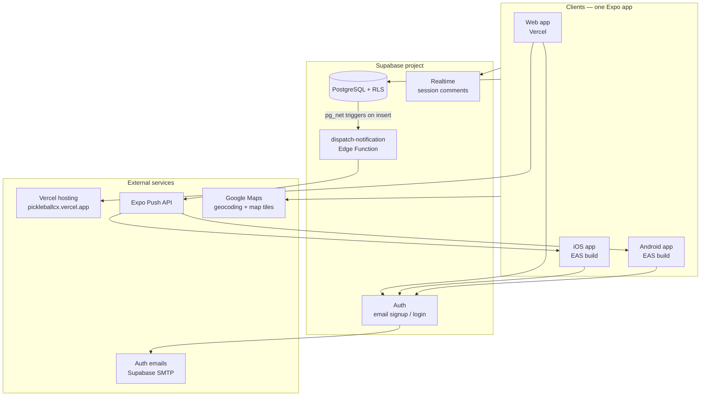
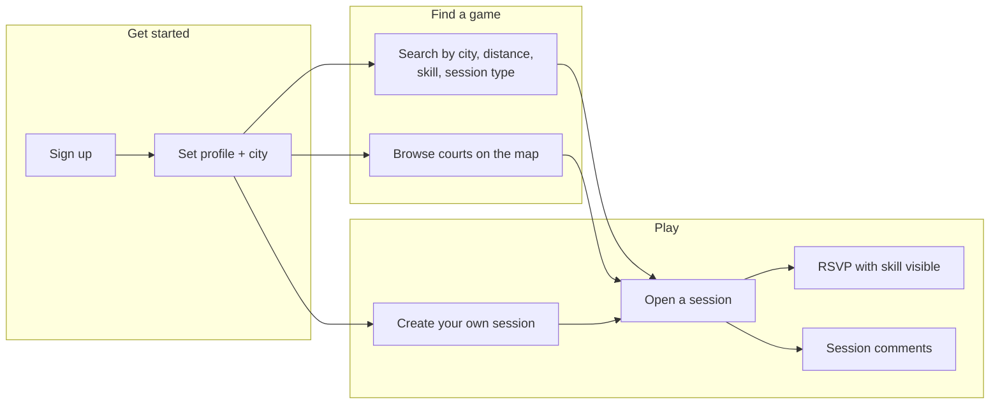
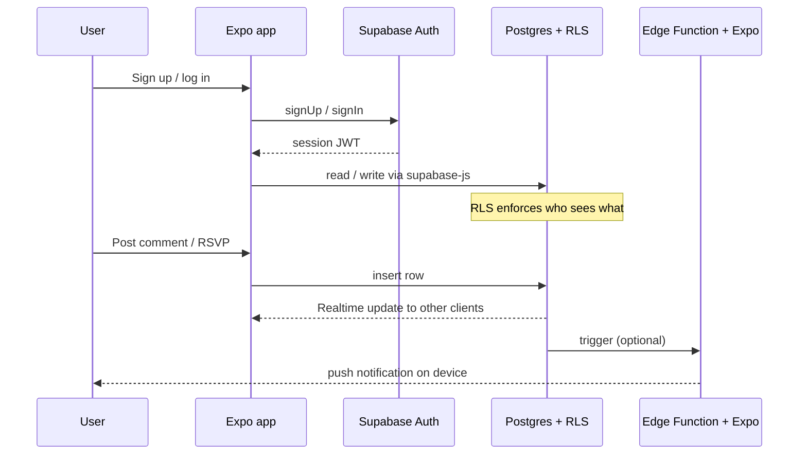
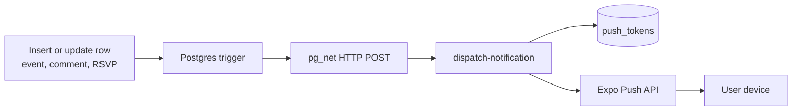
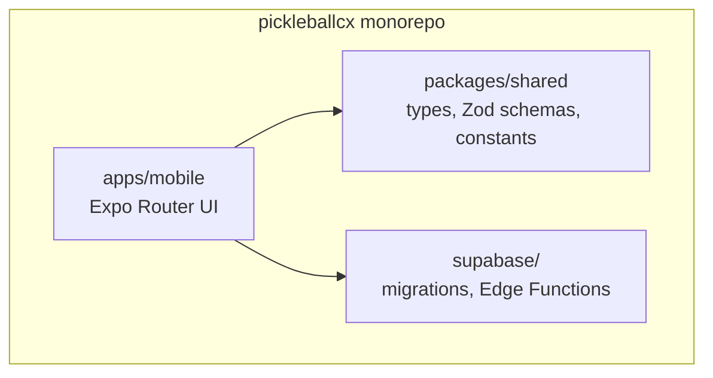

# PickleballCX — Architecture

Visual overview of how the app’s systems fit together. Diagrams use [Mermaid](https://mermaid.js.org/) — they render on GitHub and in many Markdown viewers. To export PNGs for slides or group chat, paste a diagram into [mermaid.live](https://mermaid.live).

For feature capabilities, see [`APP_OVERVIEW.md`](APP_OVERVIEW.md). For deploy and ops, see [`DEPLOY.md`](../DEPLOY.md).

---

## System overview

One **Expo** codebase ships to web (Vercel), iOS, and Android. All clients talk to **Supabase** for auth, data, realtime updates, and server-side push dispatch.



| Component | Role |
|-----------|------|
| **Expo app** | UI, navigation, forms; uses `@supabase/supabase-js` and TanStack Query |
| **Supabase Auth** | Email/password signup, sessions (JWT) |
| **PostgreSQL + RLS** | All app data; row-level security enforces who can read/write |
| **Realtime** | Live updates for session comments |
| **Edge Function** | Builds and sends push payloads via Expo when DB triggers fire |
| **Vercel** | Hosts static web export only (not the backend) |
| **Google Maps** | Geocode addresses, session card maps (`react-native-maps` native / Static Maps web) |

---

## User journey (how players use the app)

Maps to the main tabs: **Home**, **Map**, **My Games**, **Profile**.



---

## Auth and data flow

Typical request path: app authenticates with Supabase, then reads/writes Postgres through the Data API. RLS policies run on every query.



---

## Push notification path

Database triggers call `private.dispatch_notification`, which POSTs to the Edge Function via **pg_net**. The function loads push tokens and sends through **Expo Push**.



| Event | Who gets notified |
|-------|-------------------|
| Session comment | Host + RSVPs (except author) |
| New RSVP | Host |
| Session updated | Attendees |
| Session cancelled | Attendees |
| Starting soon (75–90 min out) | Going + maybe |
| Host message | Everyone on the roster |
| Post-session prompt (1 hr after it ends) | Host, plus everyone marked going |

New sessions do not broadcast push to all users (MVP anti-spam). See [`DEPLOY.md`](../DEPLOY.md) for setup.

### Scheduled jobs

Two `pg_cron` jobs drive the timeline around a session:

| Job | Schedule | Function |
|-----|----------|----------|
| `send-session-reminders` | every 15 minutes | `private.send_session_reminders()` |
| `send-post-session-prompts` | 5, 20, 35 and 50 past the hour | `private.send_post_session_prompts()` |

The reminder job notifies each session starting within 90 minutes exactly once, stamping `events.reminder_sent_at` so a later run skips it. Moving a session's start time clears the stamp so the reminder fires again for the new time. The post-session job runs an hour after a session ends, asks the host to confirm the roster and the players to rate it, then stamps `events.post_session_prompt_sent_at`. It ignores anything that finished more than three days ago, so an outage cannot produce a flood of stale prompts.

Both jobs, the broadcast RPC and attendance confirmation are the only legitimate writers of the bookkeeping columns on `events` (`reminder_sent_at`, `last_broadcast_at`, `post_session_prompt_sent_at`, `attendance_confirmed_at`). Since the events UPDATE policy lets a host edit their own row, `private.guard_event_bookkeeping` silently restores those columns on any write that does not set the `pickleballcx.allow_event_bookkeeping` flag — otherwise a host could clear `reminder_sent_at` repeatedly and make the cron job push a fresh reminder to every attendee. `event_rsvps.attended` is protected the same way, so a player cannot mark themselves present for a game they skipped.

Inspect runs with:

```sql
select * from cron.job_run_details
where jobid = (select jobid from cron.job where jobname = 'send-session-reminders')
order by start_time desc limit 10;
```

Hosts reach their roster through `public.broadcast_to_attendees(event_id, message)`, which is host-only, limited to 500 characters, throttled to one message per minute per session, and closed once the session is cancelled or over.

### After a session

`public.confirm_attendance(event_id, attended_user_ids)` is host-only and marks everyone else on the roster a no-show, which is what makes the count mean anything. `public.submit_session_feedback(event_id, rating, court_note)` records a 1-to-5 rating with an optional court note in `session_feedback`, and re-submitting replaces the previous answer.

Who may rate: a confirmed no-show may not. Before the host confirms anything, whoever said they were going may rate, so an inattentive host does not silence the whole session. Ratings are private to their author — there is no select policy for hosts, deliberately, since a host reading individual ratings of their own game is how honest feedback stops arriving.

---

## Monorepo layout



---

## Security model (high level)

- **Auth:** Supabase JWT; app sends token on every API call.
- **RLS:** Postgres policies on all public tables; users only see rows they’re allowed to access.
- **Private schema:** Helper functions (`private.can_access_event`, etc.) are not exposed via the Data API.
- **Search:** `search_events()` RPC is security definer, revoked from `anon`, and returns only public upcoming sessions.

---

## Related docs

- [`APP_OVERVIEW.md`](APP_OVERVIEW.md) — product capabilities
- [`DEPLOY.md`](../DEPLOY.md) — Vercel, EAS, push activation
- [`NOTES.md`](../NOTES.md) — deferred work
- [`PLAN.md`](../PLAN.md) — original MVP plan
